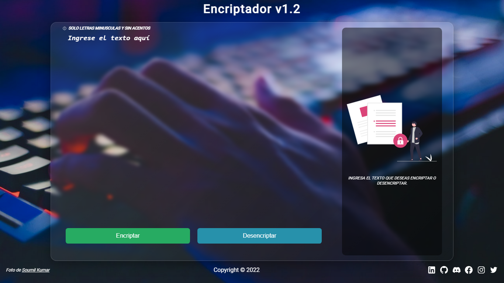

# EncriptadorTexto

Challenge ONE Encriptador de Texto

Lo que podrás hacer es encriptar/descriptar el mensaje que desees, puedes ingresar cualquier carácter especial, números, letras acentuadas... Pero estas serán reemplazadas, si es número/carácter especial las eliminará y las letras acentadas por las letras comunes.

El resultado del mismo

### Versión alterna del encriptador
 - 🔗 [Encriptador v2](https://joelmiguelvalente.github.io/encriptador-v2/) 

Este encriptador tiene
 * Modo Dark/Light
 * Dos modos de encriptación Básica/Avanzada
 
Nueva versión del encriptador en camino...
[Nueva version](https://github.com/joelmiguelvalente/challengeencriptador/tree/secundario)
